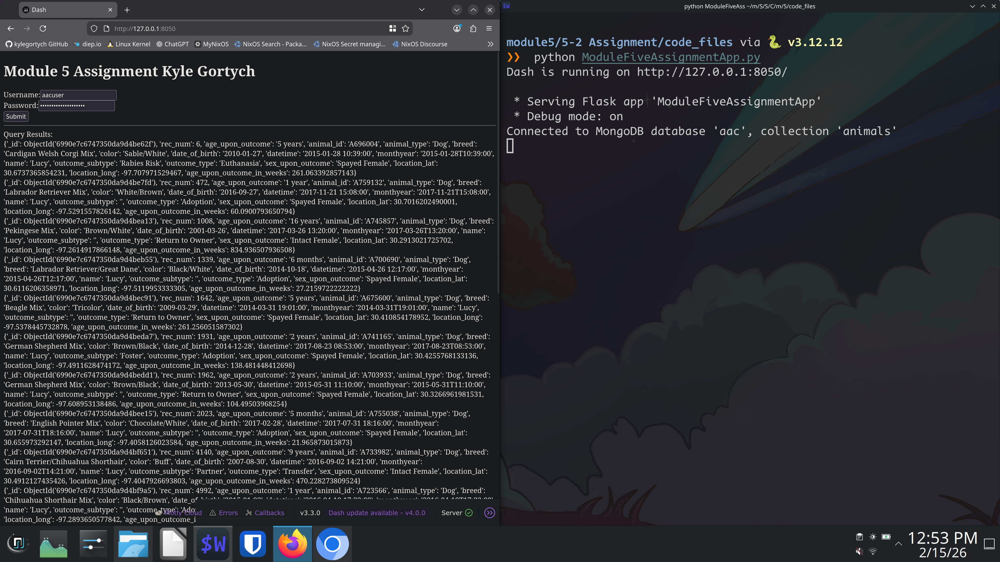

<!-- 
    ___              _                                  __ 
   /   |  __________(_)___ _____  ____ ___  ___  ____  / /_
  / /| | / ___/ ___/ / __ `/ __ \/ __ `__ \/ _ \/ __ \/ __/
 / ___ |(__  |__  ) / /_/ / / / / / / / / /  __/ / / / /_  
/_/  |_/____/____/_/\__, /_/ /_/_/ /_/ /_/\___/_/ /_/\__/  
                   /____/                                  

    ______     ___ 
   / ____/    |__ \
  /___ \________/ /
 ____/ /_____/ __/ 
/_____/     /____/ 

Date: 2/15/2026
Maintainer: Kyle Gortych
-->

<div align="right">
 


</div>

# Project 1

## About
This example CRUD python project continues the work from module 4 to include the U and D in CRUD.

## Motivation
To show the work done in assignment 5-2 for SNHU CS 340 Client/Server Development.

## Getting Started
Setup is done via `git clone url`.

## Installation

### Tools
Installation best via a system level package manager or ephemeral build environment.
Transitvie dependecies such as language are shown via tree level.

- python 3.11
    - pymongo
    - bson
- mongodb ran as a daemon/service via respective init system
- mongosh

## Usage

### Code Example

#### The CRUD_Python_Module.py file

<details>
<summary>Click to see</summary>

```python
"""
CRUD Python Module for 
"""

from pymongo import MongoClient 
from bson.objectid import ObjectId 

# add for better testing
from pymongo.errors import PyMongoError

import urllib.parse

class CRUD: 
    """ 
    CRUD operations for Animal collection in MongoDB 
    """ 

    def __init__(self, username, password, db_name='aac', host='localhost', port=27017, collection_name='animals'): 
        """
        Initialize MongoDB connection.

        param username: MongoDB username
        param password: MongoDB password
        param db_name: Database name
        param host: MongoDB host
        param port: MongoDB port
        param collection_name: Collection name
        """

        # URL encode username/password for MongoDB URI
        username = urllib.parse.quote_plus(username)
        password = urllib.parse.quote_plus(password)

         
        # Initialize Connection via try excpetion
        try: 
            self.client = MongoClient(
                f'mongodb://{username}:{password}@{host}:{port}/{db_name}?authSource=admin'
            )

            # authentication check
            self.client.admin.command('ping')

            self.database = self.client[db_name] 
            self.collection = self.database[collection_name] 

            print(f"Connected to MongoDB database '{db_name}', collection '{collection_name}'")

        except PyMongoError as e:
            raise Exception(f"Error connecting to MongoDB: {e}")

    def create(self, data):
        """
        Insert a document into the collection.

        param data: dict of key/value pair
        return: True if insert was successful, False otherwise
        """
        if not isinstance(data, dict) or not data: 
            raise ValueError("Data must be a non empty dictionary")

        try:
            self.collection.insert_one(data)
            return True
        except PyMongoError as e:
            print(f"Insert has failed: {e}")
            return False

    def read(self, query):
        """
        Query documents from the collection

        param query: query a dict of key/value pairs to match documents
        return: list of documents matching the query
        """
        if not isinstance(query, dict):
            raise ValueError("Query must be a dict")

        try:
            cursor = self.collection.find(query)
            return list(cursor)
        except PyMongoError as e:
            print(f"Read operation failed: {e}")
            return []

    def update(self, query, new_values):
        """
        Update documents in the collection.

        param query: Dictornary to match documents
        param new_values: Dictornary of update values
        return: Number of ducoments modified
        """
        if not isinstance(query, dict) or not isinstance(new_values, dict):
            raise ValueError("Query and new_values must be dictionaries")
        try:
            result = self.collection.update_many(query, new_values)
            return result.modified_count
        except PyMongoError as error:
            print(f"Update operation failed: {error}")
            return 0

    def delete(self, query):
        """
        Delete document from the collection.

        param query: dictionary to match documents
        retrun: Number of documents deleted
        """
        if not isinstance(query, dict):
            raise ValueError("Query must be a dictionary")

        try:
            result = self.collection.delete_many(query)
            return result.deleted_count
        except PyMongoError as error:
            print(f"Delete operation failed: {error}")
            return 0
```

</details>

#### The ModuleFiveAssignmentApp.py file

<details>
<summary>Click to see</summary>

```python
from dash import Dash, dcc, html
from dash.dependencies import Input, Output

from CRUD_Python_Module import CRUD

app = Dash(__name__)

app.layout = html.Div([
    html.H1("Module 5 Assignment Kyle Gortych"),
    html.Label("Username:"),
    dcc.Input(id="input_user", type="text", placeholder="Enter username"),
    html.Br(),
    html.Label("Password:"),
    dcc.Input(id="input_passwd", type="password", placeholder="Enter password"),
    html.Br(),
    html.Button("Submit", id="submit-val", n_clicks=0),
    html.Hr(),
    html.Div(id="query-out", style={'whiteSpace': 'pre-line'})
])

@app.callback(
    Output('query-out', 'children'),
    [
        Input('input_user', 'value'),
        Input('input_passwd', 'value'),
        Input('submit-val', 'n_clicks')
    ]
)

def update_output(username_input, password_input, n_clicks):
    if n_clicks > 0:
        username = username_input
        password = password_input

        try:
            crud = CRUD(username=username, password=password, db_name="aac")

            result = crud.read({"animal_type": "Dog", "name": "Lucy"})

            if result:
                formatted = "\n".join([str(doc) for doc in result])
                return f"Query Results:\n{formatted}"
            else:
                return "No results found for query."

        except Exception as e:
            return f"Error connecting to MongoDB:\n{str(e)}"

    return "Enter credentials and click Submit."

if __name__ == '__main__':
    app.run(debug=True)
```

</details>

### Tests

#### Unit Test for both files

<details>
<summary>Click to see</summary>

```python
"""
Test script for CRUD_Python_Module.py and ModuleFiveAssignmentApp.py

Maintainer: Kyle Gortych
Date: 02/15/2026
"""

import unittest
from unittest.mock import patch, MagicMock

from CRUD_Python_Module import CRUD
from ModuleFiveAssignmentApp import app  # Dash app

# Module Tests CRUD
class TestCRUD(unittest.TestCase):

    @patch("CRUD_Python_Module.MongoClient")
    def test_crud_operations(self, mock_mongo):
        # Mock the database and collection
        mock_db = MagicMock()
        mock_collection = MagicMock()
        mock_mongo.return_value.__getitem__.return_value = mock_db
        mock_db.__getitem__.return_value = mock_collection

        # Create a CRUD instance (password/username don't matter due to mock)
        crud = CRUD(username="user", password="pass")

        test_doc = {"name": "Luna", "species": "Cat", "age": 5}

        # Test create
        crud.create(test_doc)
        mock_collection.insert_one.assert_called_with(test_doc)

        # Test read
        mock_collection.find.return_value = [test_doc]
        result = crud.read({"name": "Luna"})
        self.assertEqual(result, [test_doc])

        # Test update
        mock_collection.update_many.return_value.modified_count = 1
        updated_count = crud.update({"name": "Luna"}, {"$set": {"age": 6}})
        self.assertEqual(updated_count, 1)

        # Test delete
        mock_collection.delete_many.return_value.deleted_count = 1
        deleted_count = crud.delete({"name": "Luna"})
        self.assertEqual(deleted_count, 1)

# Dash App Tests
class TestDashApp(unittest.TestCase):

    @patch("ModuleFiveAssignmentApp.CRUD")
    def test_dash_callback(self, mock_crud_class):
        # Mock the CRUD instance returned by the app
        mock_crud = MagicMock()
        mock_crud.read.return_value = [{"name": "Lucy", "animal_type": "Dog"}]
        mock_crud_class.return_value = mock_crud

        # Use Dash test client
        test_client = app.test_client()

        # Simulate callback input
        # Dash 2.0+ allows callable callbacks directly
        from ModuleFiveAssignmentApp import update_output

        response_text = update_output("user", "pass", n_clicks=1)
        self.assertIn("Lucy", response_text)

        # Test zero clicks and should prompt for credentials
        response_text = update_output("user", "pass", n_clicks=0)
        self.assertIn("Enter credentials", response_text)

# Run tests
if __name__ == "__main__":
    unittest.main()
```

</details>

### Screenshot showing operation
Shows the operation of the app file

<details>
<summary>Click to see</summary>

<div align="center">
  
</div>

</details>

